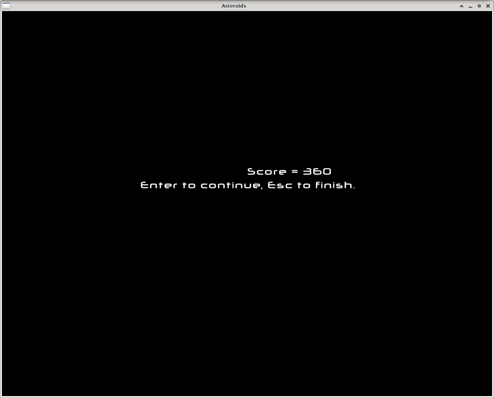

# Asteroids

## Pokretanje igre - Asteroids.lnk

Igra započinje pozdravnim ekranom. 

Nakon što se pritisne bilo koja tipka počinje igra.
Igrač dobiva ekran igre:

Kada igra završi ispisuje se rezultat (broj bodova) i način nastavka i završetka 
igre.

Strelicom prema gore igrač pokreće letjelicu koja zatim ubrzava do maksimalne brzine.

Strelicom prema dolje igrač postepeno usporava i u konačnici zaustavlja letjelicu.

Strelicama prema lijevo/desno igrač rotira letjelicu u lijevo/desno.

SPACEom igrač "puca" i razara asteroide.

Igrač ima 3 života. Živote gubi sudarajući se s asteroidima.

 
